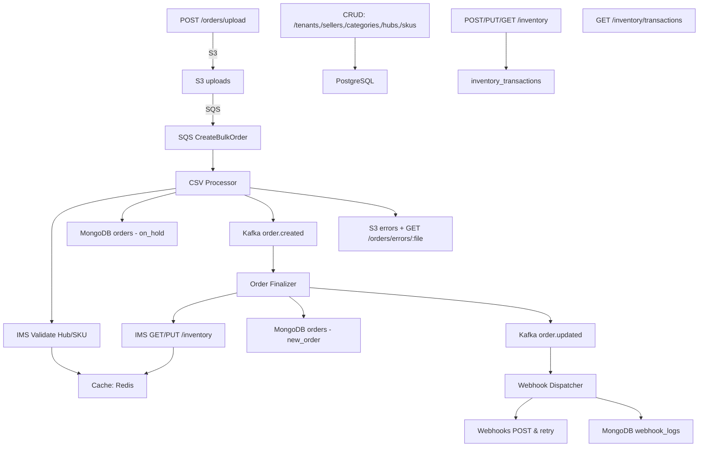

# GoCommons Microservices: OMS & IMS

## Overview
This repository contains two production-grade Go microservices built with GoCommons best practices:

- **Order Management Service (OMS)**
- **Inventory Management Service (IMS)**

They demonstrate a full event-driven flow: CSV ingestion, S3/SQS fan-out, Kafka pub/sub, atomic inventory updates, webhook dispatching, Redis caching, and REST APIs.

---

## Problem Statement
**Onboarding Task:**
Build two microservices (OMS & IMS) using GoCommons libraries/patterns.
Scope includes Kafka, SQS, Redis, REST, PostgreSQL, MongoDB, S3, and webhook delivery.

---

## Microservices Responsibilities

### 1. Order Management Service (OMS)

**CSV Upload & S3 Storage**
- Endpoint: `POST /orders/upload` (multipart file).
- Stores under `uploads/{timestamp}_{uuid}_{filename}` and enqueues SQS CreateBulkOrder.

**CSV Processor (SQS Consumer)**
- Downloads CSV from S3.
- Parses rows via encoding/csv + GoCommons CSV delimiter.
- Validates:
  - Quantity > 0
  - Hub & SKU exist (calls IMS `GET /inventory?hub_id=&sku_ids=` via GoCommons HTTP client + Redis caching).
- Valid rows → saved to MongoDB (orders collection, status on_hold) and publishes `order.created` to Kafka.
- Invalid rows → written back to S3 under errors/ and exposed via `GET /orders/errors/:file`.

**Order Finalizer (Kafka Consumer)**
- Subscribes to `order.created`.
- Retrieves current inventory from IMS (`GET /inventory`).
- If sufficient:
  - Atomically `PUT /inventory` to decrement stock.
  - Inserts a row into IMS inventory_transactions table (via IMS `POST /inventory/transactions`).
  - Updates MongoDB order status → new_order.
  - Publishes `order.updated` to Kafka.
- Else: leaves order on_hold.

**Webhook Dispatcher (Kafka Consumer)**
- Listens on `order.created` & `order.updated`.
- Delivers payload to tenant-registered callback URLs.
- Retries on transient failures, then logs permanent failures to a MongoDB webhook_logs collection.

**Public REST APIs**
- `GET /orders` — filter by tenant_id, seller_id, status, from, to.
- `POST /orders` — create a single order (validates IMS, saves, emits order.created).
- `GET /orders/errors/:file` — download invalid-rows CSV.
- Webhook management: `POST`, `GET`, `PUT`, `DELETE /webhooks`.

### 2. Inventory Management Service (IMS)

**Entity CRUD**
- Tenants, Sellers, Categories, Hubs, SKUs under `/tenants`, `/sellers`, `/categories`, `/hubs`, `/skus`.
- Supports filtering by IDs and codes, with Redis caching for hubs and SKUs.

**Inventory APIs**
- `PUT /inventory` — atomic upsert of quantity_on_hand; logs in PostgreSQL inventory_transactions.
- `GET /inventory` — returns current inventory for a hub and set of SKUs (missing combos return zero).
- `GET /inventory/transactions` — list audit trail.

---

## Tech Stack
- **Language:** Go 1.20+
- **Framework:** GoCommons (config, HTTP client, logging, i18n)
- **Messaging:** Kafka, AWS SQS (LocalStack)
- **Databases:** PostgreSQL (IMS), MongoDB (OMS)
- **Cache:** Redis
- **Storage:** S3 (LocalStack)
- **API:** REST (Gin)
- **CI:** Docker Compose for local orchestration

---

## Architecture



---

## Setup & Running Locally

### Prerequisites
- Go 1.20+
- Docker & Docker Compose
- AWS CLI (for S3 LocalStack)

### 1. Clone the Repo
```bash
git clone https://github.com/your-org/GoCommons.git
cd GoCommons
```

### 2. Start Dependencies
```bash
docker-compose up -d
```

### 3. Configure Environment
Edit `oms/configs/config.yaml` and `ims/configs/config.yaml` for:
- MongoDB URI
- PostgreSQL DSN
- Kafka brokers
- Redis address
- S3 endpoint & bucket

### 4. Run Database Migrations
```bash
psql -h localhost -U postgres -d imsdb -f ims/sql/migrations/up.sql
# MongoDB collections auto-create on write
```

### 5. Start Services
Open separate shells:
```bash
# IMS API
cd ims/cmd/server && go run main.go

# OMS API
cd oms/cmd/server && go run main.go

# CSV Processor
cd oms/cmd/worker && go run main.go

# Order Finalizer
cd oms/cmd/finalizer && go run main.go

# Webhook Dispatcher
cd oms/cmd/dispatcher && go run main.go
```

---

## API Documentation
- **Swagger:** import `swagger.yaml` at project root into Swagger Editor.

---

## Flow Overview
- Order CSV Upload → S3 + SQS
- CSV Processing → IMS validation + MongoDB + Kafka
- Order Finalization → IMS inventory check + update + Kafka
- Webhook Delivery → per-tenant callbacks + retry + failure logs
- Inventory Management → CRUD + upsert + audit trail

---

## Key Features
- Bulk ingestion with S3+SQS & dedicated worker
- Invalid-row extraction and downloadable CSV
- IMS validation of hub & SKU before order create
- Atomic inventory upsert + transaction logging
- Event-driven Kafka topology for create/update
- Webhook registration & reliable delivery with retry/logs
- Redis caching for hub/SKU lookups
- Public REST APIs for all domain operations
- i18n for error messages, structured logging

---

## Bonus Features
- Retry logic on Kafka consumption with backoff
- Webhook failure persistence in webhook_logs
- Inventory transaction audit for every stock change

---

## Screenshots
(Add diagrams/screenshots illustrating each step: CSV upload, invalid rows view, finalizer log, webhook log, IMS UI)

---

## Contributing
- Fork & clone
- `git checkout -b feature/<name>`
- Implement, test, commit
- Push & open a PR

---

## License
MIT License. See LICENSE.

---

## Contact
For questions or support, open an issue or contact the maintainers. 